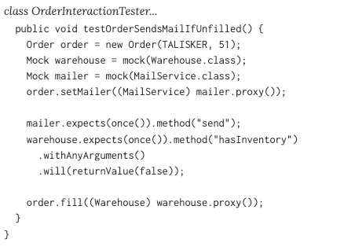
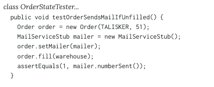

# Test double

_https://martinfowler.com/articles/mocksArentStubs.html_

- Dummy: 깡통
- Fake: 기능을 단순화해서 수행하나 프로덕션에서 사용할 수 없는 객체
- Stub: 미리 준비한 결과를 제공하는 객체
- Spy: 일정 부분 Stub이지만 과거 기록을 보여줄 수 있도록, 일부는 실제처럼 동작한다.
- Mock: 행위에 대한 기대를 명세하고 그에 따라 동작한다.

## Mock vs Stub

Mock은 행위를 검증하고, Stub은 동작에 따른 상태를 검증한다.

### Mock

### Stub
