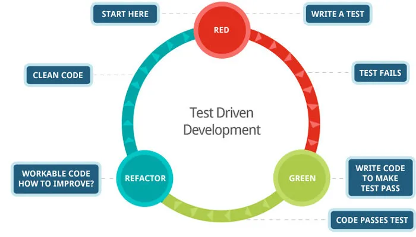
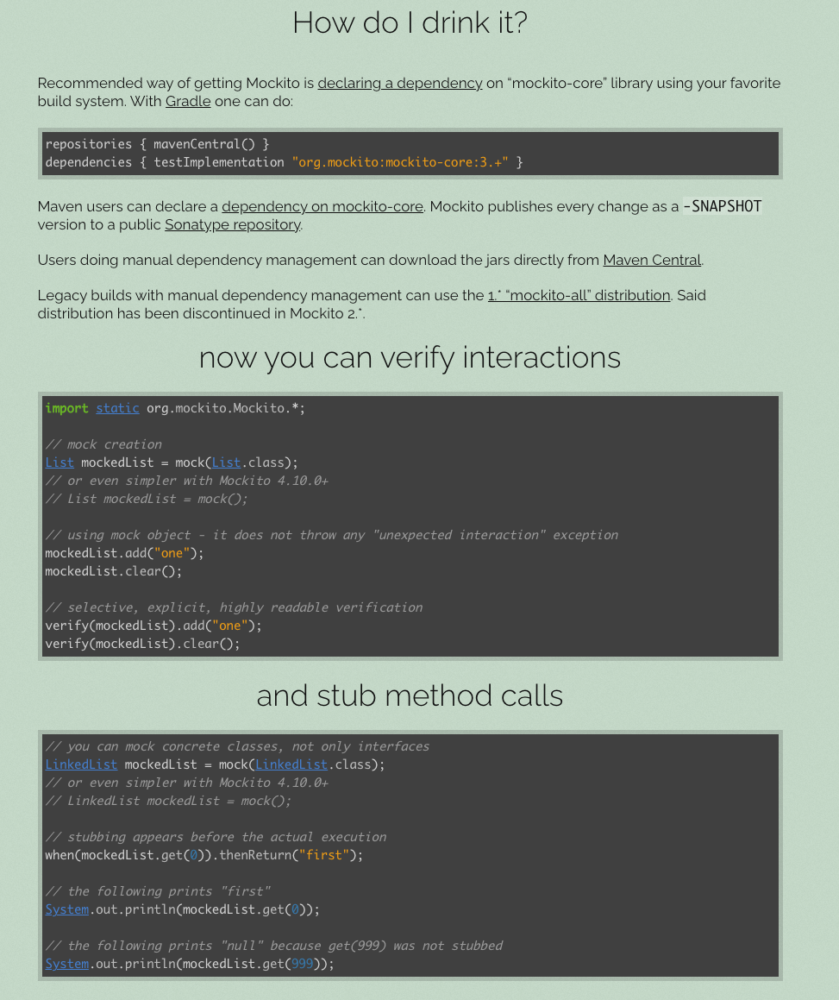

# 테스트 코드

## 테스트 코드 없는 프로젝트는

 - 경험과 감에 의해 검증한다.
 - 기능을 추가하면 기존에 있던 기능의 회귀 테스트를 사람이 해야한다.
 - 소프트웨어 품질을 낮춘다.
 - 테스터의 늦은 피드백을 받는다.

## 단위 테스트

 - 작은 코드 단위를 독립적으로 검증하는 테스트
 - 검증 속도가 빠르고 안정적이다.

## 테스트 라이브러리

- JUnit5: 단위 테스트를 위한 테스트 프레임워크
- AssertJ: 테스트 코드 작성을 원할하게 돕는 테스트 라이브러리. 풍부한 API, 메서드 체이닝 지원

## 테스트 케이스 세분화하기

 - 해피 케이스: 테스트하는 기능이 정상적으로 동작했을 때, 기대되는 결과값을 검증
 - 예외 케이스: 정상적으로 수행할 수 없는 입력, 상황에 대한 예외를 검증

___범위 조건이 있다면 경계값 테스트을 해보자___

## 테스트 코드를 테스트를 할 수 있는 코드와 아닌 코드로 구분하자

- 입력과 출력에 의존하지 않도록 한다.
- 같은 입력에는 언제나 같은 출력을 반환한다.
- 외부와 단절되도록 한다.

### 테스트하기 어려운 영역이란?

관측할 때마다 다른 값에 의존하는 코드. 예를 들면, 영업 시간에만 주문을 받기로 로직을 구현했을 때, 테스트를 영업 시간 외에 검증하면 예외가 발생되는 경우. 이럴 때는 주문을 생성하는 메서드에 매개 변수로 주문 시간을 받도록 하여, 외부에서 지정하도록 구현하면 테스트가 가능하도록 할 수 있다.
<br>

외부에 영향을 주는 코드. 메시지를 발송하거나 데이터베이스에 기록하는 것 등을 예로 들 수 있다.

## TDD



- 프로덕션 코드보다 테스트 코드를 먼저 작성함
- 당연히 구현부가 없으니 테스트가 실패함
- 테스트 컴파일은 실행될 수 있도록 깡통 로직은 만듬
- 테스트가 통과할 수 있도록 코드 구현
- 테스트 통과를 확인하면서 리팩토링을 반복함

### 피드백

_TDD의 핵심 가치_

기능 구현부터 하게 되면

- 테스트 자체를 누락할 수 있다.
- 성공 케이스만을 테스트할 수 있다.
- 잘못된 구현을 늦게 발견할 수 있다.

### 테스트부터 하게 되면,

- 복잡도가 낮은, 유연하며 유지보수가 쉬운 테스트 가능한 코드로 구현할 수 있다.
- 쉽게 발견하기 어려운 엣지 케이스를 놓치지 않게 해준다(경계값)
- 구현에 대한 빠른 피드백을 받을 수 있다.
- 과감한 리팩토링이 가능해진다.

## 테스트는 문서다

`어느 한 사람이 과거에 경험했던 고민의 결과물을 팀 차원으로 승격시켜서, 모두의 자산으로 공유할 수 있다.`

### DisplayName

Junit5에서 추가된 어노테이션

- 테스트 빌드를 인텔리제이로 하면 메서드 이름 대신에 DisplayName을 확인할 수 있다.
- 명사의 나열보다 문장으로; A이면 B이다.
- 테스트 행위에 대한 결과까지 표현하자.
- 도메인 용어를 사용하여 추상화된 내용을 담자; 메서드의 관점보다는 도메인 정책 관점으로
- 성공한다와 실패한다 같은 테스트의 현상을 중점으로 표현하지 않는다.

### BDD

- Given: 시나리오 진행에 필요한 모든 준비 과정
- When: 시나리오 진행
- Then: 결과 명시, 검증

어떤 환경에서, 어떤 행동을 진행했을 때, 어떤 상태 변화가 일어난다. -> DisplayName 명확하게 작성할 수 있다.

## 테스트 작성

### then 절

```java
    @DisplayName("상품 목록을 받아 주문을 생성하면 INIT 상태를 가진 주문이 생성된다.")
    @Test
    void createOrder() throws Exception {
        ...

        //then
        assertThat(response.getOrderId()).isNotNull();
        assertThat(response.getTotalPrice()).isEqualTo(18000);
        assertThat(response.getProductResponses()).hasSize(3)
                .extracting("productNumber", "name")
                .containsExactlyInAnyOrder(
                        tuple("001", "아메리카노"),
                        tuple("001", "아메리카노"),
                        tuple("003", "팥빙수")
                );
    }
```

- 생성된 order id 확인; notNull
  - 비즈니스 계층에서 검증해야할 부분에는 주문이 정상적으로 영속화되었는지가 포함된다.
  - 영속 계층에 대한 검증이 끝났지만 서비스 계층에서 통합 테스트가 이루어져야 하는 점을 잊지 말자.
  - OrderRepository 사용해서 db를 조회하는 것보다는 persistence context 저장되었을 때,
  - id 값이 부여되는 점을 이용해서 검증하자.
- 리스트의 경우는 사이즈와 필드값을 추출하여 검증한다.

## 테스트 메서드 충돌

- 여러 테스트 메서드를 실행하면 데이터를 저장하면서 서로 간섭할 수 있다.
- 테스트 메서드가 종료되면서 rollback 해야한다. 다음의 방법이 있다.
  - AfterEach annotation 메서드
  - 클래스에 Transactional annotation

## 컨트롤러 수동 테스트

인텔리제이에서 지원하는 http 문법을 사용해서 직접 테스트해볼 수 있다. 다음을 참고하자.

_https://sihyung92.oopy.io/etc/intellij/2_

## (매우 중요)테스트 코드 작성 시에 유의해야할 점

### 트랜잭션 관련

 - 서비스 계층의 transaction 보장이 되어있는 것을 확인하고 테스트에 트랜잭션을 걸어야한다.
   - 테스트에서 트랜잭션이 보장되는 것 또한 검증 대상이기 때문에 이를 확실하게 인지해야한다.
 - JPA를 이해하고 생성된 query가 예상했던 동작과 일치하는지 확인한다.(트랜잭션 안의 update query)

### 통합 테스트에서 영속성 검증을 빼놓지 말자

```java
@DisplayName("관리자는 타입과 상태, 이름, 가격으로 상품을 등록할 수 있다.")
@Test
void createProduct() throws Exception {
    //given
    Product product1 = createProduct("001", HANDMADE, "아메리카노", 5000);
    Product product2 = createProduct("002", HANDMADE, "카푸치노", 6000);
    productRepository.saveAll(List.of(product1, product2));

    ProductCreateRequest request = new ProductCreateRequest("아사이", 6000, HANDMADE, SELLING);

    //when
    ProductResponse response = productService.createProduct(request);

    //then
    assertThat(response)
            .extracting("productNumber", "name", "price", "type", "sellingStatus")
            .contains("003", "아사이", 6000, HANDMADE, SELLING);
}
```

when 절의 productService.createProduct() 호출하면서 반환하는 응답을 잘 검증한 것처럼 보이지만,  
관리자가 등록한 제품이 정상적으로 저장되었는지를 검증하지 않고 있다. 따라서 영속성을 가졌을 때, id가 부여된다는 점을 이용하자.

```java
assertThat(response.getId()).isNotNull();
```

## WebMvcTest

```java
@WebMvcTest(controllers = ProductController.class)
class ProductControllerTest {

}
```

WebMvcTest 어노테이션에 테스트하고자 하는 컨트롤러를 넣는다. 넣지 않으면 모든 컨트롤러를 주입받는다.

### MockBean, Mock



### 기본적인 사용방법

```java
@WebMvcTest(controllers = ProductController.class)
class ProductControllerTest {

    @MockBean
    ProductService productService;

    @Autowired
    MockMvc mockMvc;

    @Autowired
    ObjectMapper objectMapper;

    @DisplayName("관리자가 새로운 제품을 등록한다.")
    @Test
    void createProduct() throws Exception {
        //given
        ProductCreateRequest request = new ProductCreateRequest("아메리카노", 5000, HANDMADE, SELLING);

        //when //then
        mockMvc.perform(
                MockMvcRequestBuilders.post("/api/v1/products/new")
                        .content(objectMapper.writeValueAsString(request))
                        .contentType(MediaType.APPLICATION_JSON)
                )
                .andDo(MockMvcResultHandlers.print())
                .andExpect(MockMvcResultMatchers.status().isOk());
    }
}
```

- MockMvcRequestBuilders.post: http post 요청
- objectMapper.writeValueAsString(request): 직렬화
- MockMvcResultHandlers.print(): 응답의 상세한 결과 출력
- MockMvcResultMatchers.status().isOk(): 응답 status code

```java
@DisplayName("관리자가 새로운 제품을 등록할 때는 상품 이름은 필수값이다.")
@Test
void createProductWithoutName() throws Exception {
//given
ProductCreateRequest request = new ProductCreateRequest("", 5000, HANDMADE, SELLING);

//when //then
mockMvc.perform(
                MockMvcRequestBuilders.post("/api/v1/products/new")
                        .content(objectMapper.writeValueAsString(request))
                        .contentType(MediaType.APPLICATION_JSON)
        )
        .andDo(MockMvcResultHandlers.print())
        .andExpect(MockMvcResultMatchers.status().isBadRequest())
        .andExpect(MockMvcResultMatchers.jsonPath("$.code").value("400"))
        .andExpect(MockMvcResultMatchers.jsonPath("$.status").value("BAD_REQUEST"))
        .andExpect(MockMvcResultMatchers.jsonPath("$.message").value("상품 이름은 필수입니다."));
}
```

- MockMvcResultMatchers.jsonPath: 응답의 json 형태를 매핑하여 검증한다.

## 조심해야할 점

```java
@RequiredArgsConstructor
@RestController
public class ProductController {

    private final ProductService productService;
    
    @PostMapping("/api/v1/products/new")
    public ApiResponse<ProductResponse> createProduct(@Valid @RequestBody ProductCreateRequest request) {
        return ApiResponse.ok(productService.createProduct(request));
    }
}
```

- 검증하지 않을 때는 @RequestBody 필요없었지만, Valid  어노테이션으로 검증하려면 꼭 넣어주어야한다.
- https://velog.io/@appti/RequestBody-피드백을-이해하고-해결하기-위한-과정 참고

### @EnableJpaAuditing in WebMvcTest

_https://stackoverflow.com/questions/51467132/spring-webmvctest-with-enablejpa-annotation_

- WebMvcTest 진행할 때, JPA 관련 문제가 있으면 적절한 Configuration 클래스에 EnableJpa~ 넣어주면 된다. 

```java
@EnableJpaAuditing
@Configuration
public class JpaAuditingConfig {
}
```

## Classicist vs Mockist

개인에 따라 외부 의존성을 바라보는 차이가 있음을 전제한다.

- Classicist: 클래식주의자는 실제 의존성을 가진 외부 구성 요소를 사용하여 코드를 테스트하는 방식을 선호합니다. 이들은 코드를 실제 환경에서 실행하여 테스트하고, 외부 리소스(예: 데이터베이스, 파일 시스템 등)에 의존하는 코드에 대한 테스트를 포함하는 것을 중요시합니다.
- Mockist: 모킹주의자는 외부 의존성을 가지지 않는 가상의 객체를 사용하여 코드를 테스트하는 방식을 선호합니다. 이들은 테스트 중에 코드가 외부 의존성에 의존하지 않도록 가짜 객체(모의 객체)를 사용하여 코드를 격리시키고 테스트하는 것을 중요시합니다.

실제 프로덕션 코드에서 런타임 시점에 일어날 일을 정확하게 Stubbing 했다고 단언할 수 있을까?

## 추가 조언

### 완벽한 제어

#### 시간관련

주문 기능에서 운영시간에만 주문을 받을 수 있도록 했다면, 테스트의 주문 생성 시간으로 LocalDateTime.now()를 사용하면 안된다.   
테스트 실행 시간에 따라 테스트 결과가 바뀌는 것은 상황을 제대로 제어하지 못한 것이다. 가급적 now()는 쓰지 말자

#### 외부 시스템

메일 전송 서비스를 이용하면서 메일 서버에 대한 응답을 동기적으로 처리한다면, 이는 제어할 수 없는 영역임을 인식한다.  
Mocking으로 해결한다.

### Text Fixture

given 절에서 선언하는, 테스트를 위해 원하는 상태로 고정시킨 일련의 객체를 의미한다.

#### BeforeAll, BeforeEach(setUp method)

공통된 엔터티(텍스쳐)의 선언을 줄이기 위해서 위 어노테이션으로 해결할 수 있다.  
하지만 이는 테스트 간의 결합도를 증가시키는 단점을 포함함으로 다음의 질문에 해당하지 않을 때만 사용하자.

- 각 테스트 입장에서: 아예 몰라도 테스트 내용을 이해하는 데에 문제가 없는가?
- 수정해도 모든 테스트에 영향을 주지 않는가?

내가 했던 프로젝트의 예시를 들면, TeamService 테스트를 진행하면서 Team을 생성하기 위해 꼭 필요한 List<TeamPosition>가 있었다.
팀을 생성하기 위해 어쩔 수 없이 선언해야하는 엔터티로, 테스트를 이해하기 위해서 필요하지 않았기 때문에 따로 빼서 선언해도 좋다.
  
테스트 하나가 문서로써 역할을 다할 수 있도록 하자.

#### 객체(Fixture) 생성

가능하면 빌더와 생성자만으로 생성하자. 그리고 파라미터는 테스트의 의도를 이해할 수 있도록 필요한 요소만 넣을 수 있도록 한다.
또한, 테스트 클래스마다 객체 생성 메서드(생성자와 빌더로만 구성된)를 작성하는 것이 결합도를 낮출 수 있어 좋다.

#### Fixture 클렌징 with deleteAll, deleteAllInBatch

테스트의 독립성을 보장하기 위해 영속 객체를 지우는 과정을 거친다. 방법에는 transactional과 @AfterEach tearDown()을 정의하는 것이 있다.
  
다음을 주의하자. 

- transactional: 트랜잭션을 테스트할 수 없다. 추가로 spring batch를 사용하여 여러 트랜잭션이 포함된 테스트를 진행하면 이 방법을 사용할 수 없다.
- AfterEach: deleteAll을 사용할 경우, 엔터티를 삭제하기 전에 관련 엔터티를 조회하고, 연관된 모든 엔터티를 지우려고 시도한다. 성능상 이점이 있는 deleteAllInBatch를 사용하는 것이 좋다. 하지만 삭제하는 순서에 유의하여 fk 에러가 생기지 않도록 한다.
